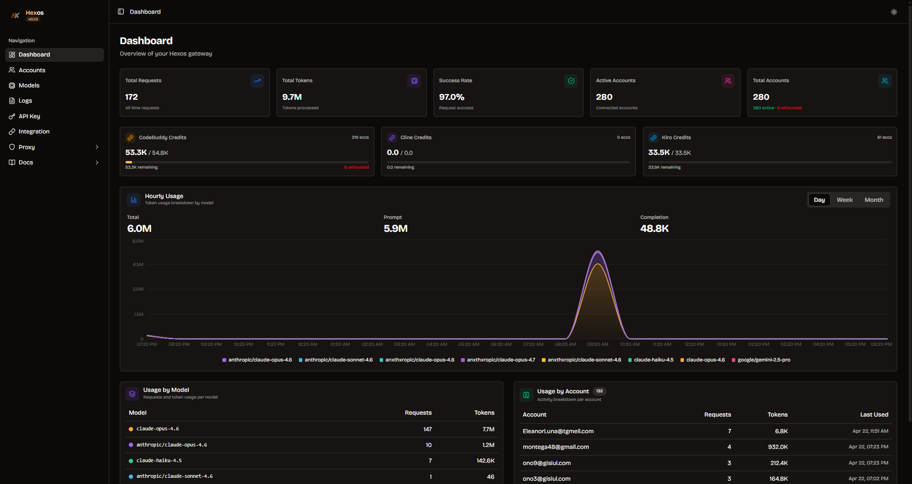

# Hexos — Multi-Provider AI API Proxy

Multi-provider AI API proxy with multi-account management, browser automation, and a built-in dashboard. Routes requests through CodeBuddy, Cline, and Kiro to access Assistant, GPT, Gemini, DeepSeek, and more — all via a single OpenAI-compatible endpoint.

Built with [Bun](https://bun.sh) + [Hono](https://hono.dev) + [lowdb](https://github.com/typicode/lowdb). Dashboard with [Next.js 16](https://nextjs.org) + [Tailwind v4](https://tailwindcss.com) + [shadcn/ui](https://ui.shadcn.com).



## Install

**Linux / macOS:**

```bash
curl -fsSL https://hexos.kadangkesel.net/install | bash
```

**Windows (PowerShell):**

```powershell
irm https://hexos.kadangkesel.net/install.ps1 | iex
```

This installs the `hexos` binary, dashboard, and automation scripts to `~/.hexos/`.

## Quick Start

```bash
# 1. Start server (API + dashboard on same port)
hexos start

# 2. Open dashboard
# http://localhost:7470

# 3. Generate API key
hexos key create

# 4. Setup browser automation (optional, for batch login)
hexos auth setup-automation

# 5. Connect accounts
hexos auth auto-connect --email user@gmail.com --password "pass"

# Or batch connect from file
hexos auth batch-connect --file accounts.txt
```

## Features

- **3 Providers**: CodeBuddy (Tencent), Cline, Kiro (AWS CodeWhisperer)
- **35+ Models**: Claude Opus/Sonnet/Haiku, GPT-5.x, Gemini, DeepSeek, Kimi, GLM, MiniMax, Qwen, Grok
- **Multi-Account**: Manage 200+ accounts with automatic least-used load balancing
- **Worker Pool Concurrency**: Batch login without waiting for slow accounts
- **Auto Failover**: 401 → token refresh → next account. Tries ALL accounts before failing
- **Credit Monitoring**: Per-account credit check after each request (dosage-notify API)
- **Browser Automation**: Camoufox (anti-detect Firefox) for Google OAuth login
- **Built-in Dashboard**: Real-time monitoring, account management, batch operations, usage charts
- **Tool Integration**: Auto-bind to Claude Code, OpenCode, OpenClaw, Cline, Hermes
- **Context Window**: Per-model context length exposed via `/v1/models` (up to 1M tokens)
- **One-Command Install**: `curl | bash` installer with auto-update support

## CLI Commands

```
hexos start [-p port] [--host]     Start the proxy server (default: localhost:7470)
hexos key create                   Generate an API key
hexos key list                     List all API keys
hexos auth connect <provider>      Manual OAuth flow (opens browser)
hexos auth auto-connect            Automated login via Camoufox
hexos auth batch-connect --file    Batch login from email|password file
hexos auth list                    List all connections with status/credits
hexos auth status                  Check token validity + show credits
hexos auth remove <id>             Remove a connection
hexos auth setup-automation        Install Python + Camoufox for browser automation
hexos usage stats [--today]        Aggregate usage statistics
hexos usage log [-n limit]         Recent usage records
hexos update                       Update hexos to latest version
hexos uninstall                    Uninstall hexos (preserves data)
```

## Providers & Models

### CodeBuddy (prefix: `cb/`)

| Model ID | Context |
|----------|---------|
| `cb/claude-opus-4.6` | 1M |
| `cb/claude-haiku-4.5` | 200K |
| `cb/gpt-5.4` | 1M |
| `cb/gpt-5.2` | 200K |
| `cb/gpt-5.1` / `cb/gpt-5.1-codex` | 1M |
| `cb/gpt-5.1-codex-mini` | 200K |
| `cb/gemini-2.5-pro` / `cb/gemini-2.5-flash` | 1M |
| `cb/gemini-3.1-pro` / `cb/gemini-3.0-flash` | 1M |
| `cb/kimi-k2.5` | 131K |
| `cb/glm-5.0` | 128K |

### Cline (prefix: `cl/`)

| Model ID | Context |
|----------|---------|
| `cl/claude-opus-4.7` / `cl/claude-opus-4.6` | 1M |
| `cl/claude-sonnet-4.6` | 1M |
| `cl/claude-haiku-4.5` | 200K |
| `cl/grok-4` | 256K |
| `cl/gemini-2.5-pro` / `cl/gemini-2.5-flash` | 1M |
| `cl/deepseek-v3.2` / `cl/deepseek-r1` | 128K |
| `cl/kimi-k2.6` | 131K |
| `cl/gemma-4-26b:free` / `cl/minimax-m2.5:free` / `cl/gpt-oss-120b:free` | Free tier |

### Kiro (prefix: `kr/`)

| Model ID | Context |
|----------|---------|
| `kr/claude-sonnet-4.5` / `kr/claude-sonnet-4` | 200K |
| `kr/claude-haiku-4.5` | 200K |
| `kr/deepseek-3.2` | 128K |
| `kr/qwen3-coder-next` | 131K |
| `kr/glm-5` | 128K |
| `kr/minimax-m2.1` | 1M |

## API Endpoints

| Method | Path | Description |
|--------|------|-------------|
| `POST` | `/v1/chat/completions` | Chat completions (OpenAI-compatible, SSE stream) |
| `POST` | `/v1/messages` | Messages API (Anthropic-compatible) |
| `GET` | `/v1/models` | List models with context lengths |
| `GET` | `/health` | Health check |

## Dashboard

The dashboard is built-in — served at `http://localhost:7470` when you run `hexos start`.

For development:

```bash
cd dashboard && bun install && bun dev
# Opens at http://localhost:7471 (proxies API to :7470)
```

### Pages

- **Dashboard**: Credit summary (3 providers), usage charts, model/account breakdown
- **Accounts**: Paginated table with search/filter, batch add, filter unconnected, batch logs
- **Models**: Full model catalog with context windows
- **Logs**: Request logs with filtering
- **Integration**: Auto-bind to AI coding tools (Claude Code, OpenCode, OpenClaw, Cline, Hermes)
- **API Key**: Manage API keys
- **Proxy**: HTTP proxy pool management + scraper
- **Docs**: API documentation

## Tool Integration

Hexos auto-binds to AI coding tools via the Integration page:

| Tool | Config File | Format |
|------|-------------|--------|
| Claude Code | `~/.claude/settings.json` | JSON (env vars) |
| OpenCode | `~/.config/opencode/opencode.json` | JSON (provider block) |
| OpenClaw | `~/.openclaw/openclaw.json` | JSON5 (models.providers) |
| Cline | `~/.cline/endpoints.json` | JSON (apiBaseUrl) |
| Hermes | `~/.hermes/config.yaml` | YAML (custom_providers) |

## Multi-Account & Load Balancing

```
Client Request → Pick least-used account → Forward to upstream
  ↓ (401)        → Refresh token → Retry
  ↓ (still fails) → Next least-used account (tries ALL before giving up)
  ↓ (429 credit)  → Mark disabled → Next account
  ↓ (success)     → Increment usage → Check credit (async, non-blocking)
```

### Worker Pool Concurrency

Batch connect uses a worker pool — each worker grabs the next account as soon as it finishes. No waiting for slow/stuck accounts.

```
Worker 1: account1 → done → account3 → done → account5 → ...
Worker 2: account2 → stuck 90s → account4 → ...
```

### Credit Monitoring

- **CodeBuddy**: `get-dosage-notify` API (Bearer token) — detects exhausted (code 14001/14018) vs active (code 0). Default display: 250/250 credits.
- **Cline**: `/api/v1/users/{uid}/balance` (Bearer token) — exact balance.
- **Kiro**: `getUsageLimits` API — usage limits with remaining count.
- Credits updated per-account after each successful proxy request (non-blocking).
- No auto-polling — manual "Check Credits" button available.

## Architecture

```
~/.hexos/
  bin/hexos          ← Standalone binary (Bun-compiled)
  dashboard/         ← Static HTML/CSS/JS (Next.js export)
  automation/        ← Python scripts for browser automation
    .venv/           ← Created by 'hexos auth setup-automation'
  db.json            ← Connections + API keys (lowdb)
  usage.json         ← Usage tracking records
  proxies.json       ← HTTP proxy pool
  proxy-settings.json← Proxy configuration
```

### Single Process

```
hexos start
  → API server on :7470/v1/* and /api/*
  → Dashboard served on :7470/ (same port)
```

No separate dashboard process needed in production.

## Development

```bash
# Clone
git clone https://github.com/kadangkesel/hexos
cd hexos && bun install

# Dev server (hot-reload)
bun dev

# Dashboard dev (separate process)
cd dashboard && bun install && bun dev

# Build binary for current platform
bun scripts/build.ts

# Build for all platforms
bun scripts/build.ts --all
```

### Release

```bash
# Bump version in package.json, then:
git tag v0.2.0
git push origin v0.2.0

# GitHub Actions automatically:
# 1. Builds 5 binaries (linux-x64, linux-arm64, darwin-x64, darwin-arm64, windows-x64)
# 2. Exports dashboard as static HTML
# 3. Creates GitHub Release with all artifacts + checksums
# 4. Updates hexos.kadangkesel.net version file
```

## License

MIT
